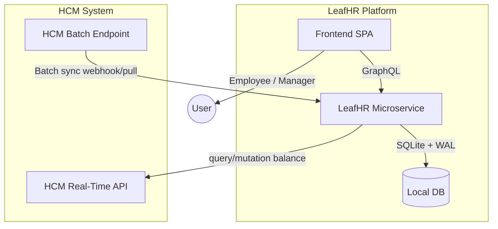
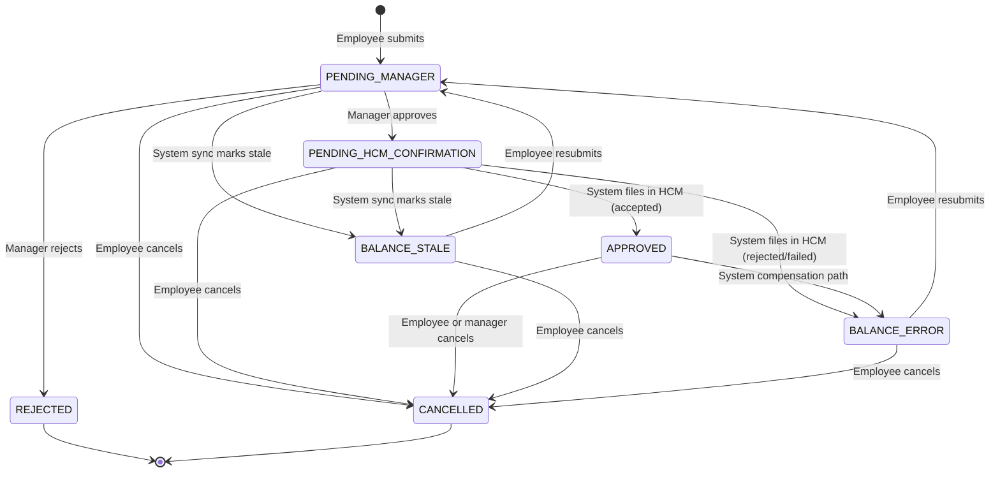
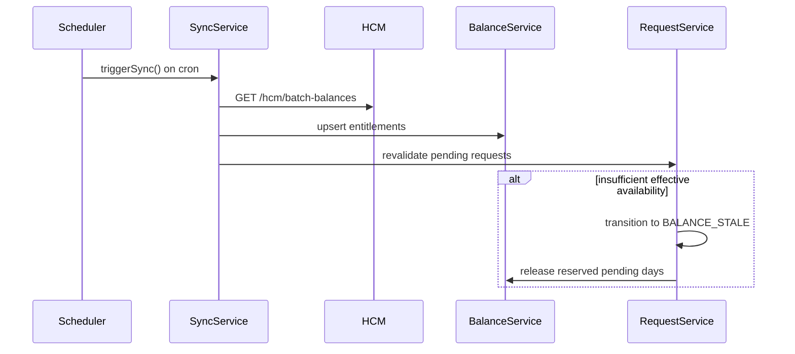

# TRD — LeafHR Time-Off Microservice
### Take-Home Exercise
**Version:** 2.1.0 | **Status:** Draft | **Date:** 2026-04-24 | **Author:** Leticia

---

## Table of Contents

1. [Executive Summary](#1-executive-summary)
2. [Business Context & Problem Statement](#2-business-context--problem-statement)
3. [User Personas](#3-user-personas)
4. [System Boundaries](#4-system-boundaries)
5. [Security & Authorization Model](#5-security--authorization-model)
6. [Functional Requirements](#6-functional-requirements)
7. [Technical Challenges & Analysis](#7-technical-challenges--analysis)
8. [Proposed Architecture](#8-proposed-architecture)
9. [Data Model](#10-data-model)
10. [Alternatives Considered & Design Decisions](#11-alternatives-considered--design-decisions)
11. [Non-Functional Requirements](#12-non-functional-requirements)
12. [Test Strategy](#13-test-strategy)
13. [Deliverables Checklist](#14-deliverables-checklist)
14. [Open Questions](#15-open-questions)
15. [Hard Constraints](#17-hard-constraints)

---

## 1. Executive Summary

**LeafHR** is a time-off management microservice that stays synchronized with an external Human Capital Management (HCM) system (e.g., Workday, SAP). The HCM is the **single source of truth** for employee leave balances. This document defines the technical requirements for LeafHR, built with **NestJS + SQLite**, responsible for:

- Managing the full lifecycle of a time-off request.
- Maintaining a local, eventually-consistent replica of HCM balances (per employee and location).
- Defending against race conditions, stale data, authorization bypass, and HCM unavailability.

> [!IMPORTANT]
> LeafHR MUST treat the HCM as authoritative. Local balances are a performance cache — never the deciding vote. Employee identity MUST always come from the verified JWT token, never from request body fields.

---

## 2. Business Context & Problem Statement

### 2.1 Context

LeafHR's time-off module is one of many consumers of HCM data. Balances can change **outside** LeafHR at any time:

| Trigger | Initiated by | Timing |
|---|---|---|
| Manual admin correction | HR team via HCM UI | Any time |
| Work anniversary bonus | HCM automation | Employee anniversary date |
| Year-start balance refresh | Customer configuration | Jan 1 (or fiscal year start) |
| Time-off approval in HCM | Manager/HR via HCM | Any time |

### 2.2 Core Problem

**Keeping local balances truthful when HCM is the source of truth.**

A naive implementation that only tracks requests submitted via LeafHR will inevitably diverge from the HCM balance, causing:

- Employees submitting requests against insufficient balance (→ rejection by HCM).
- Employees seeing stale "available days" (→ trust erosion).
- Duplicate/conflicting approvals from two simultaneous submissions (→ compliance risk).

### 2.3 Success Criteria

| # | Criterion |
|---|---|
| SC-01 | An employee always sees the balance reflecting HCM's last known value. |
| SC-02 | A submitted request is validated against HCM before being committed locally. |
| SC-03 | HCM-initiated balance changes are reflected in LeafHR within an acceptable SLA. |
| SC-04 | The system is defensive: local validation + HCM validation, never just one. |
| SC-05 | Two simultaneous submissions by the same employee cannot together exceed the available balance. |
| SC-06 | No employee can access or modify another employee's data (zero IDOR risk). |

---

## 3. User Personas

### 3.1 The Employee

- **Goal:** See my accurate leave balance and submit requests with instant feedback.
- **Pain point:** Submitting a request only to hear "HCM rejected it" 5 minutes later.
- **Expectation:** If the UI says I have 5 days of vacation, I can request 5 days.

### 3.2 The Manager

- **Goal:** Approve or deny requests knowing the data is valid.
- **Pain point:** Approving a request that HCM will later invalidate.
- **Expectation:** Only see requests from my direct reports. The approval flow shows the real, HCM-confirmed balance.

---

## 4. System Boundaries



**In scope:**
- Time-off request CRUD with server-side date validation.
- Local balance cache management (per employee and location).
- Real-time HCM balance read before submission.
- Pending balance reservation to prevent concurrent over-commitment.
- Batch sync ingestion from HCM.
- Conflict detection and resolution.
- JWT-based RBAC authorization.

**Out of scope:**
- HCM authentication/SSO (mocked in tests).
- Frontend UI components.
- Notification delivery (email/push).

---

## 5. Security & Authorization Model

> [!IMPORTANT]
> **Identity must always be derived from the verified JWT token — never from a client-supplied field in the request body.** This prevents Insecure Direct Object Reference (IDOR) attacks where a user passes another employee's ID.

### 5.1 JWT Claims Structure

Every request requires a `Bearer` token with the following claims:

```json
{
  "sub": "emp-123",
  "role": "employee" | "manager" | "system",
  "locationId": "loc-NYC",
  "managerId": "emp-456",
  "reportIds": ["emp-111", "emp-222"]
}
```

| Claim | Purpose |
|---|---|
| `sub` | Canonical employee ID — extracted by the guard, never from body |
| `role` | Controls which endpoints and records are accessible |
| `locationId` | Scopes balance queries |
| `managerId` | Who this employee reports to |
| `reportIds` | (Manager only) list of direct reports the manager may act on |

### 5.2 Role-Based Access Control (RBAC)

| Operation | `employee` | `manager` | `system` |
|---|---|---|---|
| `query myBalances(year)` | Own only | Own only | Internal only |
| `query employeeBalances(employeeId, year)` | ❌ | Direct reports only | Internal only |
| `query myRequests(year)` | Own only | Own only | Internal only |
| `query request(id)` | Own scope only | Own scope only | Internal only |
| `query pendingManagerApprovals` | ❌ | Direct reports only | ❌ |
| `mutation submitRequest(input)` | Own only | Own only | ❌ |
| `mutation transitionRequest(input)` | Allowed by state machine | Allowed by state machine | Allowed by state machine |

### 5.3 Guard Enforcement Rules

1. Identity in service logic is always derived from JWT claims (`sub`, `role`, `locationId`, `managerId`, `reportIds`).
2. A manager attempting to approve a request for an employee NOT in their `reportIds` MUST receive a GraphQL error with code `FORBIDDEN`.
3. `submitRequest` does not accept `employeeId`; employee identity is always `token.sub`.

### 5.4 Transport & Secrets

- All external communication (LeafHR → HCM) MUST use HTTPS in production. The mock uses HTTP on localhost for test convenience only.
- Secrets (JWT signing key, HCM API key) are injected via environment variables — never hard-coded or committed to source control.
- The `.env` file is in `.gitignore`; only `.env.example` with placeholder values is committed.
- Current implementation uses HS256 and `JWT_SECRET` from environment for verification.
- Token TTL policy is environment/application dependent and not enforced in this codebase.

### 5.5 Input Validation

- DTO-level validation exists, but there is no global `ValidationPipe` configuration in bootstrap at this time.
- Date range inputs (`startDate`, `endDate`) are validated for format, logical order (`startDate ≤ endDate`), and minimum duration before any DB or HCM call is made.
- `computedDays` is always calculated server-side — a client-supplied day count is rejected.

---

## 6. Functional Requirements

### 6.1 Balance Management

| ID | Requirement | Priority |
|---|---|---|
| FR-B01 | The service MUST store a local balance record per `(employeeId, locationId)` tuple. | Must |
| FR-B02 | The service MUST refresh the actor-scoped local balance from HCM before display; current implementation uses batch pull + local upsert in `myBalances`. | Must |
| FR-B03 | The service MUST accept and process HCM batch sync payloads to bulk-update local balances. | Must |
| FR-B04 | The service MUST detect conflicts when a batch sync contradicts a pending local request. | Must |
| FR-B05 | Local balance records SHOULD include source metadata (`HCM_REALTIME`, `HCM_SYNC`, etc.) for reconciliation/audit. | Should |
| FR-B06 | The service MUST maintain a `pending` counter per balance record representing reserved days for active request lifecycle states. | Must |
| FR-B07 | Effective available days for submission = `totalEntitled - used - pending`, enforced through reservation checks in write service. | Must |

### 6.2 Time-Off Request Lifecycle

| ID | Requirement | Priority |
|---|---|---|
| FR-R01 | Employees MUST be able to submit a time-off request with: `locationId`, `startDate`, `endDate`, `notes`. | Must |
| FR-R02 | The service MUST compute `days` server-side from `startDate`/`endDate`. Clients MUST NOT supply a `days` field. | Must |
| FR-R03 | On submission, if no local balance exists for `(employee, location, leaveType, year)`, the service MUST lazy-fetch from HCM and seed local entitlement. | Must |
| FR-R04 | The service MUST reject requests where `computedDays > available`, where `available = totalEntitled - used - pending`. | Must |
| FR-R05 | Reservation and request persistence SHOULD be transactionally protected; current implementation performs sequential operations without explicit DB transaction wrapping. | Should |
| FR-R06 | The service MUST reject overlapping requests against active non-archived requests (`PENDING_MANAGER`, `PENDING_HCM_CONFIRMATION`, `APPROVED`, `BALANCE_STALE`, `BALANCE_ERROR`). | Must |
| FR-R07 | The service MUST forward approved requests to HCM and handle HCM rejection gracefully. | Must |
| FR-R08 | Requests MUST progress through a defined state machine (see §8.3). | Must |
| FR-R09 | Managers MUST be able to approve or reject pending requests for their direct reports only. | Must |
| FR-R10 | Employees MUST be able to cancel eligible requests; managers may cancel approved direct-report requests. Cancellation archives by setting `archivedAt` and releasing reserved balance. | Should |
| FR-R11 | The service MUST expose an audit trail for every state transition, including `actorId` and `actorRole`. | Must |

### 6.3 Sync & Resilience

| ID | Requirement | Priority |
|---|---|---|
| FR-S01 | If HCM real-time API is unavailable during submission, the service MUST return `503` and persist no state. Clients retry. | Must |
| FR-S02 | Sync is automatic via scheduler (cron). There is no public `/sync` endpoint or GraphQL mutation in the current implementation. | Must |
| FR-S03 | If HCM filing fails during system confirmation, request transitions to `BALANCE_ERROR` and reserved balance is released. | Must |
| FR-S04 | On scheduled sync, LeafHR re-validates pending requests and marks invalid ones as `BALANCE_STALE`. | Must |
| FR-S05 | A request in `BALANCE_STALE` may be cancelled or resubmitted back to `PENDING_MANAGER` by employee role. | Must |

---

## 7. Technical Challenges & Analysis

### Challenge 1 — Dual-Write Race Condition (Balance vs. Batch Sync)

**Scenario:** Employee submits a request. Simultaneously, HCM processes a work-anniversary bonus. Two writers update the same balance record at the same time.

**Risk:** Lost update — local balance ends up incorrect.

**Mitigation:**
- Use **optimistic locking** on the `Balance` entity (`version` INTEGER column).
- Every balance write: `UPDATE ... WHERE version = :prev`. Row count = 0 → retry from HCM.
- All balance mutations go through `BalanceService` exclusively.

---

### Challenge 2 — Concurrent Submissions by the Same Employee

**Scenario:** Employee opens two browser tabs and submits two 3-day requests simultaneously. HCM balance = 5 days. Both pass HCM validation independently → 6 days booked against 5 available.

**Risk:** Over-commitment. HCM will reject the second request, leaving a dangling state.

**Mitigation:**
- The implementation uses a `pending` column on `balance` to reserve days.
- Explicit `BEGIN IMMEDIATE` transaction control is not currently implemented.
- Effective check is `available >= requestedDays`, where `available = totalEntitled - used - pending`.
- Reserved days are confirmed to `used` on approval, or released on reject/cancel/stale/error.

```
SELECT available, version FROM balance WHERE ...;
-- check: available >= requestedDays
UPDATE balance SET pending = pending + :days WHERE ...;
INSERT INTO time_off_request ...;
```

---

### Challenge 3 — HCM as Authority but Not Always Available

**Scenario:** HCM is down during a submission window.

**Mitigation:**
- **Default (unplanned downtime):** Block submission, return `503`. Do not persist state. Prompt retry.
- Planned maintenance queueing is not currently implemented.

---

### Challenge 4 — Batch Sync Invalidates Pending Requests

**Scenario:** Employee requests 3 days. Before manager approval, HCM batch sync arrives and sets the `VACATION` balance to 1 day.

**Mitigation:**
- On every scheduled batch sync, re-validate pending requests per employee.
- If balance cannot sustain the pending request, transition to `BALANCE_STALE` and release reserved days.
- Notification delivery is out of scope; actor can inspect status and audit trail.

---

### Challenge 5 — Idempotency of HCM Writes

**Scenario:** Network timeout causes LeafHR to retry forwarding a request to HCM. HCM has already processed it.

**Risk:** Double-booking of days.

**Mitigation:**
- Generate `idempotencyKey = UUID v4` per request at creation time, stored in DB.
- Forward as `Idempotency-Key` header on every HCM call.
- HCM is expected to be idempotent on the same key.
- Reconcile via batch sync — if HCM indicates a different final outcome, transition locally via state machine.

---

### Challenge 6 — BALANCE_ERROR Compensation

**Scenario:** Request transitions to `APPROVED`. LeafHR forwards to HCM. HCM rejects (e.g., race with HCM-side correction). Request → `BALANCE_ERROR`.

**Risk:** `pending` remains incremented, blocking future valid submissions.

**Mitigation:**
- On entry to `BALANCE_ERROR`: release reserved `pending` days.
- Log the HCM rejection reason in the audit trail and refresh the balance from HCM.
- Employee must resubmit; new submission goes through the full validation flow.
- Trigger a balance refresh from HCM to reconcile the local cache.

---

### Challenge 7 — SQLite Concurrency

SQLite's default journal mode serializes all writes. For concurrent request submissions, **WAL (Write-Ahead Logging)** mode is required so readers are not blocked during writes.

**Configuration at startup:**
```sql
PRAGMA journal_mode=WAL;
PRAGMA busy_timeout=5000;
```

Write concurrency is currently delegated to TypeORM/SQLite defaults and optimistic versioning on entities.

---

## 8. Proposed Architecture

### 8.1 Layer Overview

```
├── src/
│   ├── auth/
│   │   ├── gql-auth.guard.ts               # Validates Bearer token and GraphQL context
│   │   ├── roles.guard.ts                  # RBAC enforcement (see §5.2)
│   │   ├── current-user.decorator.ts       # @CurrentUser() from JWT claims
│   │   └── auth.module.ts
│   ├── balance/
│   │   ├── balance.entity.ts               # (employeeId, locationId, leaveType, year, totalEntitled, used, pending, version)
│   │   ├── balance.read.repository.ts      # SELECT-only queries (find by composite key, list by employee)
│   │   ├── balance.write.repository.ts     # INSERT / UPDATE with optimistic lock; no SELECT logic
│   │   ├── balance.read.service.ts         # Read path: fetch cached balance, resolve source flag
│   │   ├── balance.write.service.ts        # Write path: upsertBatch, decrementPending, optimistic lock
│   │   ├── balance.resolver.ts             # GraphQL queries: myBalances / employeeBalances
│   │   └── balance.module.ts
│   ├── request/
│   │   ├── request.entity.ts               # Lifecycle state machine, archiving (archivedAt)
│   │   ├── request.read.repository.ts      # SELECT-only queries (find by id, list by employee/manager)
│   │   ├── request.write.repository.ts     # INSERT / UPDATE (status, archivedAt); no SELECT logic
│   │   ├── request.read.service.ts         # Read path: retrieve requests, filter by RBAC scope
│   │   ├── request.write.service.ts        # Write path: submit, approve, reject, cancel, state machine
│   │   ├── request.resolver.ts             # GraphQL resolver (queries + mutations)
│   │   └── request.module.ts
│   ├── hcm/
│   │   ├── hcm.client.ts                   # HTTP client for HCM real-time + batch APIs
│   │   ├── hcm.dto.ts                      # HCM request/response shapes
│   │   └── hcm.module.ts
│   ├── sync/
│   │   ├── sync.service.ts                 # Batch sync consumer + pending re-validation
│   │   └── sync.scheduler.ts               # Cron-driven sync (no public trigger mutation)
│   ├── user/
│   │   ├── entities/
│   │   │   ├── user.entity.ts              # User table (id, externalId, email, name, audit timestamps)
│   │   │   └── user-role.entity.ts         # UserRole table (userId, locationId, role, audit timestamps)
│   │   ├── user.service.ts                 # findByIdOrFail, findRolesForUser, hasRole, hasAnyRole
│   │   └── user.module.ts
│   └── app.module.ts
├── test/
│   ├── unit/
│   ├── integration/
│   └── e2e/
│       └── hcm-mock-server/                # Mock HCM server — see §8.5
```

### 8.2 Read / Write Service and Repository Split

Each domain (`balance`, `request`) follows a **strict read/write separation** at both the repository and service layers. This is a lightweight CQRS-inspired pattern — not full event sourcing — applied to keep query and command paths independently testable and to confine mutation risk.

#### Responsibilities

| Layer | Read | Write |
|---|---|---|
| **Repository** | `*.read.repository.ts` — only `SELECT` queries. Never calls `save()`, `update()`, or `delete()`. | `*.write.repository.ts` — only `INSERT` / `UPDATE` (soft). Never returns a query `SelectQueryBuilder`. |
| **Service** | `*.read.service.ts` — only injects the read repository. Resolves response shape and scoped reads. | `*.write.service.ts` — injects write repositories and required read repositories for pre-condition checks. Owns the state machine and `pending` bookkeeping. |

#### Dependency rules

```
Resolver
  ├── *.read.service   → *.read.repository
  └── *.write.service  → *.write.repository
                        └── *.read.repository   (pre-condition checks only)
```

- **Resolvers** wire to the correct service based on the operation type: `query` resolvers call `*.read.service`; `mutation` resolvers call `*.write.service`.
- **`*.write.service`** may call `*.read.repository` for look-ups needed before a mutation (e.g., fetching the current balance row to check the version for optimistic locking), but it MUST NOT call `*.read.service` (to avoid indirection between write and aggregated-read logic).
- **`SyncService`** calls `balance.write.service` and `request.write.service` exclusively — it never reads through the read layer.
- No cross-domain repository imports: `request.*` never imports `balance.repository.*` directly; it goes through `balance.write.service` or `balance.read.service`.

#### Testing implications

- Read services and repositories can be unit-tested in isolation with only a mock TypeORM `Repository<T>`.
- Write services are integration-tested against an in-memory SQLite database to validate transaction atomicity and optimistic lock behaviour.
- RBAC test cases only need to mock the read or write service; they do not need a DB at all.

---

### 8.3 SQLite Initialization

Current bootstrap is minimal (`NestFactory.create` + `listen`) and relies on TypeORM defaults from module configuration. No explicit WAL/PRAGMA block is configured in app bootstrap.

### 8.4 Request State Machine (Implemented)



Invariant: every transition writes an audit row (`request_audit`) with actor identity and statuses.

### 8.5 Mock HCM Server

The standalone mock HCM server (`test/e2e/hcm-mock-server/`) supports:

| Endpoint | Behavior |
|---|---|
| `GET /hcm/balances/:employeeId/:locationId/:leaveType` | Returns scoped balance |
| `POST /hcm/time-off` | Idempotent filing, accepts/rejects based on scenario/balance |
| `GET /hcm/batch-balances` | Returns full corpus used by scheduled sync and read refresh |
| `GET /hcm/health` | Health check |
| `POST /mock/scenario` | Scenario control |
| `POST /mock/seed` | Seed balances |
| `POST /mock/reset` | Reset in-memory state |
| `GET /mock/calls` | Inspect call log |

### 8.6 Sync Flow (Implemented)



---

### 9.1 GraphQL Schema (Implementation Snapshot)

The API is exposed at `POST /graphql`.

Implemented queries:
- `myBalances(year: Int!): [BalanceType!]!`
- `employeeBalances(employeeId: String!, year: Int!, locationId: String): [BalanceType!]!`
- `myRequests(year: Int): [TimeOffRequestType!]!`
- `request(id: String!): TimeOffRequestType!`
- `pendingManagerApprovals: [TimeOffRequestType!]!`

Implemented mutations:
- `submitRequest(input: SubmitRequestInput!): TimeOffRequestType!`
- `transitionRequest(input: TransitionInput!): TimeOffRequestType!`

Not implemented:
- `triggerSync`
- `approveRequest`, `rejectRequest`, `cancelRequest` as dedicated mutations (all handled by `transitionRequest`)

### 9.2 Standard Error Shape

GraphQL errors are returned in the top-level `errors` array with `extensions` fields (`code`, `httpStatus`, `details`) when mapped from domain errors.

### 9.3 Behavior Notes

- `myRequests` and manager pending list return only non-archived requests (`archivedAt IS NULL`).
- `request(id)` may return archived records if caller has scope access.
- `submitRequest` computes business days server-side and ignores client-side day counts.
- `myBalances` refreshes from HCM batch view for actor scope before returning local data.

---

## 10. Data Model (Implementation Snapshot)

### 10.1 `balance`

Key fields:
- `employeeId`, `locationId`, `leaveType`, `year` (unique composite)
- `totalEntitled`, `used`, `pending`
- `source`, `version`, timestamps

Computed property:
- `available = totalEntitled - used - pending`

### 10.2 `time_off_request`

Key fields:
- `employeeId`, `locationId`, `leaveType`, `startDate`, `endDate`
- `startDateTimestamp`, `endDateTimestamp`, `totalDays`
- `status`, `managerId`, `year`, `archivedAt`, timestamps

### 10.3 `request_audit`

Key fields:
- `requestId` (FK), `fromStatus`, `toStatus`
- `actorId`, `actorRole`, `comment`, `timestamp`

---

## 11. Alternatives Considered & Design Decisions

| # | Decision | Chosen Approach |
|---|---|---|
| DD-01 | Request lifecycle model | State machine with explicit audit trail |
| DD-02 | Persistence style | CRUD entities + audit table |
| DD-03 | Sync trigger | Cron scheduler (`SYNC_CRON_EXPRESSION`) |
| DD-04 | Database | SQLite + TypeORM + optimistic version field |
| DD-05 | Duration source | Server-computed business days from date range |
| DD-06 | Balance conflict handling | Reserve/release/confirm days in write service |

---

## 12. Non-Functional Requirements

| ID | Category | Requirement |
|---|---|---|
| NFR-01 | Performance | `query myBalances` (including HCM refresh path) SHOULD respond in < 500 ms (p95) in local/test conditions. |
| NFR-02 | Performance | `mutation submitRequest` (including availability checks) SHOULD respond in < 1000 ms (p95) in local/test conditions. |
| NFR-03 | Availability | LeafHR MUST remain operational during HCM downtime. Read paths may fall back to local data where applicable; `submitRequest` SHOULD fail safely when required HCM data is unavailable. |
| NFR-04 | Security | All endpoints MUST require `Authorization: Bearer <jwt>`. Unsigned or expired tokens → `401`. |
| NFR-05 | Security | Access to employee-scoped data MUST be validated against actor scope (`sub`, `reportIds`, location scope). Mismatch → `403`. |
| NFR-06 | Observability | All HCM calls MUST be logged with: timestamp, method, duration, response code, `idempotencyKey`. |
| NFR-07 | Data Integrity | `(employeeId, locationId, leaveType, year)` balance records MUST have unique constraint at DB level. |
| NFR-08 | Data Integrity | `pending` MUST never go negative. Any attempt to decrement below 0 MUST throw and abort persistence. |
| NFR-09 | Idempotency | All mutating HCM calls MUST carry `Idempotency-Key` header. |
| NFR-10 | Retry | Retry/backoff behavior is implementation-specific and SHOULD be explicitly covered by integration tests where introduced. |
| NFR-11 | Compliance | `time_off_request` rows MUST be archived (`archivedAt` set) on cancellation. Physical deletion is not permitted. |

---

## 13. Test Strategy

> [!NOTE]
> Per the exercise guidelines, the value lies in the rigor of the test suite. Tests drive implementation — no line of production code is written without a red test first.

### 13.1 Test Pyramid

```
         ┌───────────────────┐
         │ Integration Tests │  ← LeafHR + SQLite (WAL) + Mock HCM server
         ├───────────────────┤
         │   Unit Tests      │  ← Services, DTOs, state machine, guard logic (no I/O)
         └───────────────────┘
```

### 13.2 Unit Test Cases

| ID | Target | Scenario | Expected |
|---|---|---|---|
| UT-01 | `BalanceService.update()` | Optimistic lock: version mismatch | Throws `ConflictException` |
| UT-02 | `RequestService.submit()` | `computedDays > available` | Returns insufficient balance error |
| UT-03 | `RequestService.submit()` | Date range overlaps existing PENDING request | Returns `409 OVERLAP_CONFLICT` |
| UT-04 | `RequestService.submit()` | HCM real-time unavailable | Returns `503 HCM_UNAVAILABLE` |
| UT-05 | State machine | `PENDING_HCM_CONFIRMATION → APPROVED` when HCM confirms | `pending` confirmed to `used`, audit entry created |
| UT-06 | State machine | `PENDING_HCM_CONFIRMATION → BALANCE_ERROR` when HCM rejects | reserved `pending` released, audit entry created |
| UT-07 | `SyncService.revalidatePending()` | Batch sync reduces entitlement below pending | Request → `BALANCE_STALE`, reserved `pending` released |
| UT-08 | Idempotency | Same `idempotencyKey` submitted twice | Second call returns same `requestId`, no duplicate |
| UT-09 | RBAC guard | Employee calls manager-only transition (`PENDING_MANAGER -> PENDING_HCM_CONFIRMATION`) | `NOT_AUTHORIZED_TRANSITION` |
| UT-10 | RBAC guard | Manager approves request not in `reportIds` | `403 FORBIDDEN` |
| UT-11 | `RequestService.submit()` | `employeeId` body field differs from `token.sub` | Body field ignored; `token.sub` used |
| UT-12 | `BalanceService` | `pending` would go negative on decrement | Throws, does not persist |

### 13.3 Integration Test Cases

| ID | Scenario | Mock HCM Behavior | Expected |
|---|---|---|---|
| IT-01 | Submit + manager approve, HCM confirms | VACATION balance = 10, request = 3 days | Status → `APPROVED`, pending released/confirmed, balance updated |
| IT-02 | Submit request, insufficient availability | VACATION balance = 1, request = 3 days | insufficient balance error, no committed request |
| IT-03 | Two simultaneous submissions, balance = 5 | Both request 4 days | First accepted (`PENDING_MANAGER`), second rejected by availability check |
| IT-04 | Overlapping date range | Existing PENDING May 1–5, new May 3–7 | `409 OVERLAP_CONFLICT` |
| IT-05 | Batch sync during pending request | VACATION balance drops to 0 after sync | Pending → `BALANCE_STALE`, reserved days released |
| IT-06 | HCM unavailable: submit | HCM returns 503 | `503` to client, no request persisted |
| IT-07 | Retry on HCM timeout | HCM behavior per client implementation | Failure is surfaced; no inconsistent state |
| IT-08 | Scheduled sync run | HCM batch returns new balances | Local balances updated during cron-driven sync |
| IT-09 | Work anniversary bonus mid-flow | VACATION balance increases during pending approval | Request proceeds normally |
| IT-10 | BALANCE_ERROR compensation | HCM rejects during system confirmation | reserved `pending` released and status = `BALANCE_ERROR` |
| IT-11 | Archive / cancel of pending | Employee cancels | `archivedAt` set, reserved pending released, status = `CANCELLED` |
| IT-12 | IDOR attempt | Employee A accesses Employee B data | `FORBIDDEN` error |

### 13.4 Coverage Goals

| Layer | Target |
|---|---|
| Unit (statements) | ≥ 90% |
| Integration (critical paths) | 100% of scenarios in §13.3 |
| Mutation testing | Run `stryker-mutator` on `BalanceService`, `RequestService`, and RBAC guards |

---

## 14. Deliverables Checklist

- [ ] **TRD** (this document) — reviewed and approved.
- [ ] **GitHub Repository** — LeafHR NestJS + SQLite project scaffold.
- [ ] **Mock HCM Server** — standalone, deployable (e.g., Railway/Render free tier), with scenario API.
- [ ] **Unit Tests** — all UT-01 to UT-12 passing with ≥ 90% statement coverage.
- [ ] **Integration Tests** — all IT-01 to IT-12 passing.
- [ ] **Coverage Report** — `lcov` or Istanbul HTML report committed to repo.
- [ ] **README** — setup instructions, how to run tests, how to start mock HCM, WAL mode note.
- [ ] **Migration files** — TypeORM or raw SQL migrations (no `synchronize: true` in production).

---

## 15. Open Questions

| # | Question | Owner | Resolution |
|---|---|---|---|
| OQ-01 | Does HCM support `Idempotency-Key` headers natively, or do we implement deduplication locally? | LeafHR Engineering | Pending HCM API docs |
| OQ-02 | What is the SLA window for batch sync delivery from HCM? (minutes, hours?) | Product / HCM team | Needed for `lastSyncedAt` cache TTL decision |
| OQ-03 | Are balances always measured in days for this exercise? | Product | Confirms whether any unit normalization is needed |
| OQ-04 | Do `reportIds` come from the JWT, or must LeafHR query an org chart endpoint to verify lineage? | Product / Auth team | Impacts RBAC guard design — see UD-03 in §20 |
| OQ-05 | Should `computedDays` exclude weekends and public holidays? If yes, which calendar per location? | Product | Impacts server-side day computation (FR-R02) |
| OQ-06 | What is the maximum balance value HCM can return? (Needed for `pending` overflow guard, NFR-08) | HCM team | Required before DB schema is finalized |
| OQ-07 | Are there leave request minimum/maximum duration rules (e.g., half-days, max 30 days)? | Product | Needed for `mutation submitRequest` validation — see UD-05 in §20 |


## 17. Hard Constraints

These are non-negotiable boundaries — not design preferences. Any solution that violates one is not valid.

| # | Constraint | Rationale |
|---|---|---|
| HC-01 | The HCM is the single source of truth for balances. LeafHR's local copy is a cache only. | Prevents LeafHR from approving leave the HCM would reject; avoids compliance drift. |
| HC-02 | Employee identity MUST come from the verified JWT `sub` claim, never from any field in the request body. | Closes IDOR / privilege-escalation attack surface at the source. |
| HC-03 | Reserved balance (`pending`) MUST be updated consistently with request lifecycle transitions. | Inconsistency causes over-commitment and incorrect availability. |
| HC-04 | No `UPDATE` or physical `DELETE` on `leave_request` rows — all state changes update the status column; cancellation sets `archivedAt`. | Full audit trail is a compliance requirement; physical deletes destroy evidence. |
| HC-05 | `mutation submitRequest` MUST return `HCM_UNAVAILABLE` when the HCM is unreachable. Requests must not be committed against a stale balance without explicit degraded-mode policy approval. | A cached balance may already be partially consumed by an HCM-side change LeafHR hasn't seen yet. |
| HC-06 | Optimistic locking via `version` column SHOULD be applied on balance cache writes. | Reduces silent corruption risk during concurrent sync and request mutations. |
| HC-07 | Balances are scoped per `(employeeId, locationId)` tuple — not globally per employee. | An employee working across locations has independent entitlements per location; collapsing them causes incorrect availability calculations. |
| HC-08 | The mock HCM batch endpoint is polled by LeafHR scheduled sync (`GET /hcm/batch-balances`). | Preserves implemented data-flow direction and test harness behavior. |
| HC-09 | Only `*.write.repository.ts` files MAY call TypeORM `save()`, `update()`, `delete()`, or execute a raw `UPDATE`/`INSERT`. `*.read.repository.ts` MUST contain only `SELECT` operations. | Enforces the read/write separation at the boundary where violations are hardest to catch in review; prevents accidental mutations leaking through the read path. |

---
